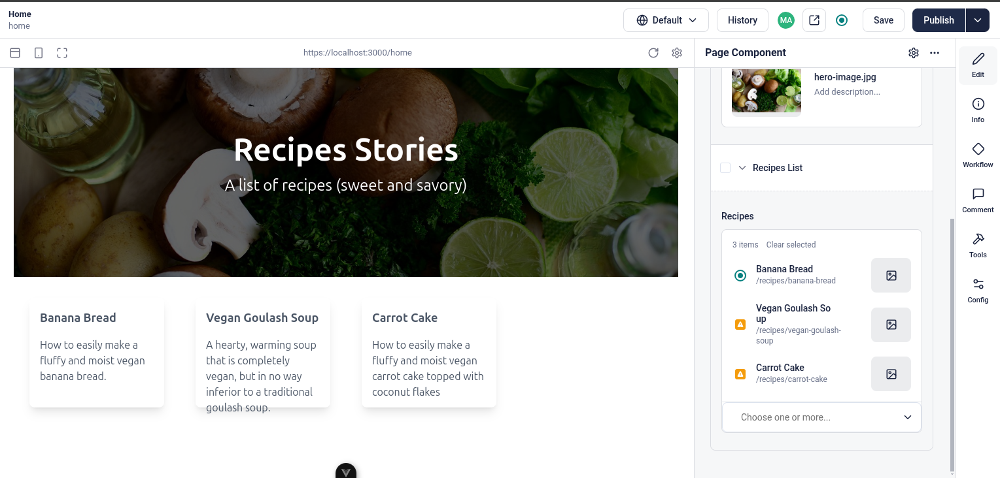
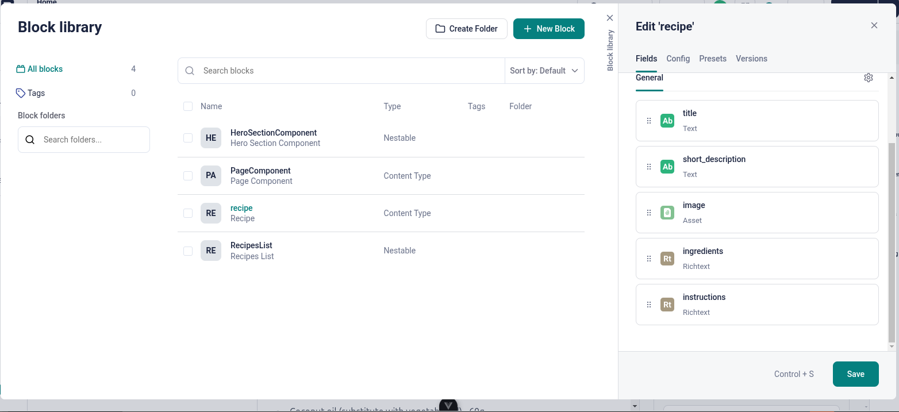
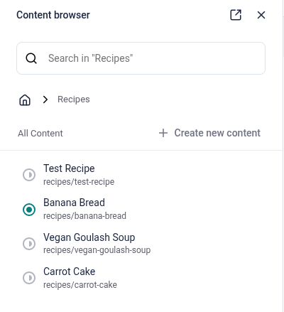

# cooking-stories

A simple website for recipes using [VueJS](https://vuejs.org/), [Storyblok](https://www.storyblok.com/docs).


_Fig 1. Preview_


_Fig 2. Blocks_


_Fig 3. Content_

## Project Setup

```sh
npm install
```

### Compile and Hot-Reload for Development

```sh
npm run dev
```

### Type-Check, Compile and Minify for Production

```sh
npm run build
```

### Lint with [ESLint](https://eslint.org/)

```sh
npm run lint
```

## Storyblok Setup

Go to [Spaces](https://app.storyblok.com/#/me/spaces) and add a new space `cooking-stories`.

### Components/Blocks

In the new space go to **Blocks Library** on the left-hand menu, or go do **Dashboard**, then **Blocks**.

1. Change the `page` block with type _Content type block_ to `PageComponent`. Then, if there is no `body`, add a new field named `body` with field type _Blocks_. This will be our root block for a page that can contain different blocks. You can delete the rest of the default blocks.

2. Now add a New Block with type _Content type block_ and name it `recipe`, this will be the schema for our recipes. Add these following fields:
    - title: Text
    - short_description: Text
    - image: Asset
    - ingredients: Richtext
    - instructions: Richtext

3. For the home page we need a _Nestable_ component for the Hero Section. So create a New Block with type _Nestable_ and name it `HeroSectionComponent`, then add the following fields:
    - title: Text
    - subtitle: Text
    - image: Asset

4. Next, we need a component for a list of recipes, so create a new Block of type _Nestable_, then add a field named `recipes` with field type _References_ or _Multi Options (References).

### Content

In the space `cooking-stories` go to **Content** in the left-hand menu. There should be a `Home Story` with some default values,  click on it and the Editor will open, make sure to be in Form mode instead of Visual mode for now.

Now we can add our component for the Home page. Add a Block within `Body`, choose `HeroSectionComponent`. You can add the title, subtitle, and the image for it. Then add a block again and choose `Recipes List`, we'll use this later.

Go back to Content and Create a new Folder, called `Recipes`, then restrict the Content Type to _Recipe_. Click on the Recipes folder. In here you can add your recipes by creating new stories of content type _Recipe_ and adding the text and image in each of the fields in the editor.

### Configuration

#### Access Tokens

Go to Settings in your cooking-stories space and navigate to Configuration/Access Tokens. You should have a Preview token by default (this will be used in development or draft mode), you can create a new Public token to use on production (this will only show published content). You can add these as environment variables following the `.env.example` file.

#### Preview URLs

In the Settings, navigate to Configuration/Visual Editor and change the location of the default environment to `https://localhost:3000/`, including the `/`.

In the Preview URLs section you can add your Live url when you have one from where your app is deployed.

#### ENV Variables

Draft

```sh
VITE_STORYBLOK_TOKEN=<YOUR_PREVIEW_TOKEN>
VITE_STORYBLOK_IS_PREVIEW=true
```

Published

```sh
VITE_STORYBLOK_TOKEN=<YOUR_PUBLIC_TOKEN>
VITE_STORYBLOK_IS_PREVIEW=false
```
